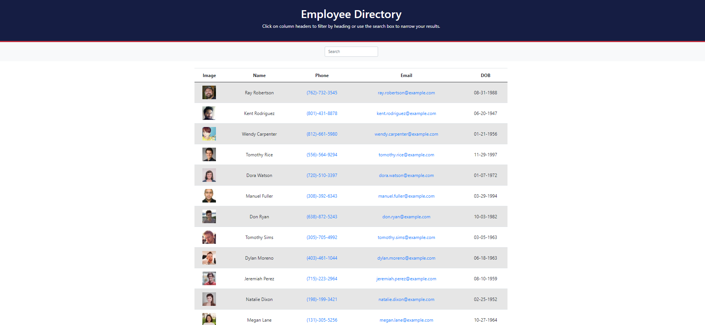

# Employee Directory 🗃️

## Description

A web application that lists all employees in one directory using React. The user can search employees by their first or last name, or sort the employees by their phone number or email address.
## Installation

To install the required dependencies, run `npm install`

This package assumes there is a MongoDB server running on localhost:27017. If your server is running somewhere else, you can edit `server.js` to reflect that.

## Usage

* Clone/fork repo and install the necessary dependencies. Run the server with `npm start` and view application in your browser at `http://localhost:3000`.
### Screenshots

An example screenshot of the application:

Please check out the launched app on Git Hub Pages [here](https://ssingle7.github.io/employee-directory/)!

## Credits

* Tutor 

* Ask BCS 
## License

Copyright (c) [2020] [Selena Singleton]
